>
>
>Universidad San Carlos de Guatemala
>
>Facultad de Ingeniería 
>
>Escuela de Ciencias y Sistemas 
>
>Segundo Semestre, 2022
>
>Laboratorio de Redes de Computadoras 2 

### Grupo No.5

Integrantes:

| Nombre                               | Carnet    |
| ------------------------------------ | --------- | 
|  &nbsp;Jimmy Yorbany Noriega Chávez         | 200915691 |
|   &nbsp; Melyza Alejandra Rodríguez Contreras | 201314821 |
|  &nbsp; Romael Isaac Pérez Godinez           | 201213545 | 
|  &nbsp; Josué Alfredo González Caal          | 201602489 | 

# Proyecto - Fase 2

## Contenido
- Implementacion de ACLs para controlar el tráfico en las subredes 

## Implementacion de ACLs para controlar el tráfico en las subredes 
> ¿Qué es una ACL?
> 
> Por sus siglas en inglés ***access control list***, una ***lista de control de acceso*** es un concepto de seguridad informática usado para fomentar la separación de privilegios. Es una forma de determinar los permisos de acceso apropiados a un determinado objeto, dependiendo de ciertos aspectos del proceso que hace el pedido.
> 
> Las ***ACL*** permiten controlar el flujo del tráfico en equipos de redes, tales como enrutadores y conmutadores. Su principal objetivo es filtrar tráfico: permitir o denegar el tráfico de red de acuerdo con alguna condición. Sin embargo, también tienen usos adicionales, como, por ejemplo, distinguir "tráfico interesante" (tráfico suficientemente importante como para activar o mantener una conexión) en RDSI (red digital de servicios integrados).
> 
> 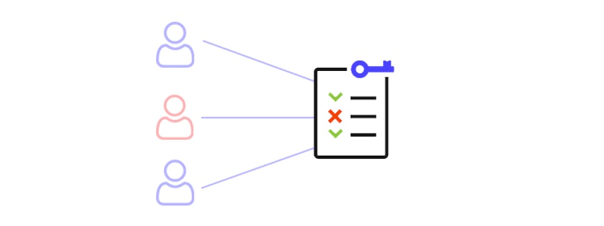

### Pasos para configurar una lista de control de acceso en AWS
1. Ingresar al **Panel VPC** dentro de la consola de AWS

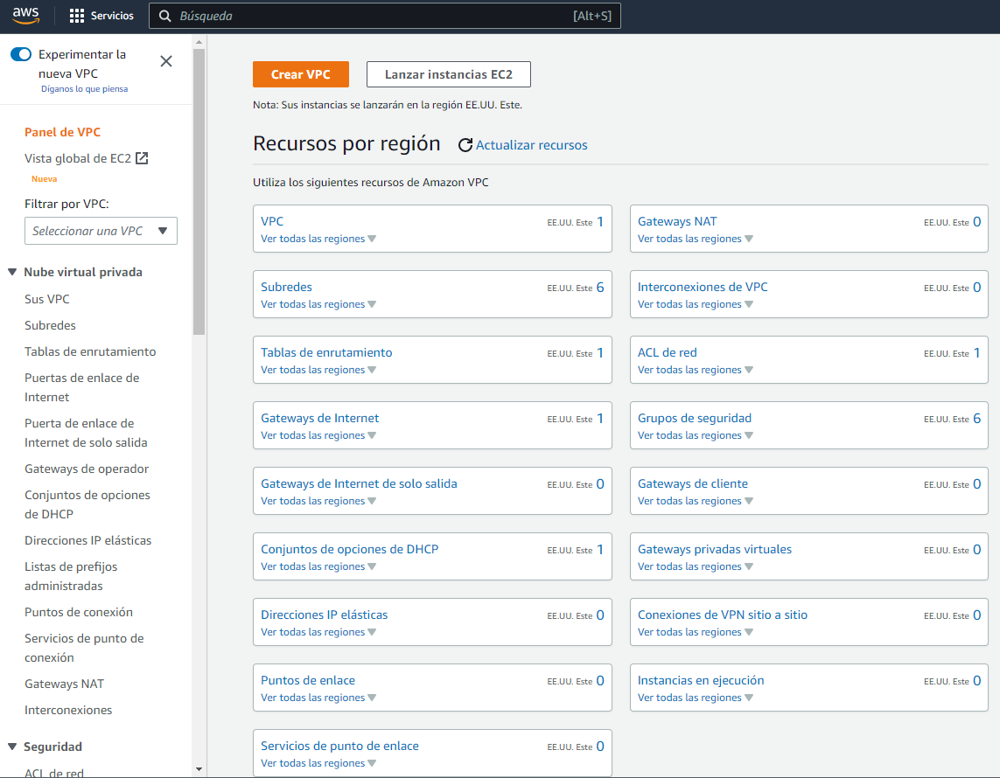

2. En el apartado de **Seguridad** (ubicado en el panel de navegación izquierdo), seleccionar la opción **ACL de red**.

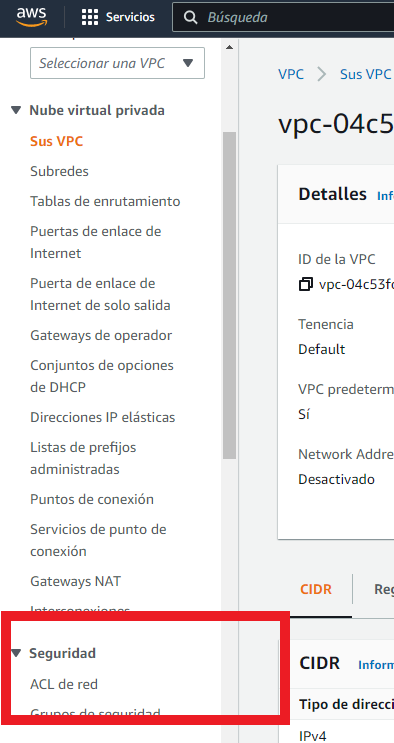

3. Seleccionar la opción ***CREAR ACL DE RED***.

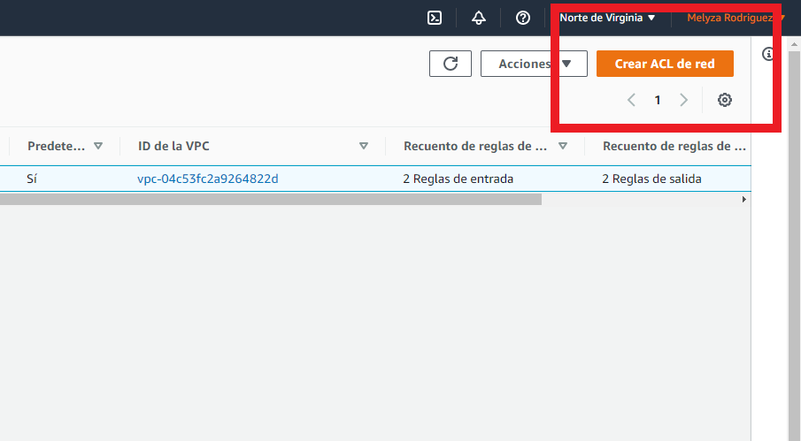

4. Colocar un nombre y seleccionar una VPC para crear la nueva lista de control de acceso. Posteriormente, hacer click en la opción **CREAR**, en la parte inferior de la pantalla. 

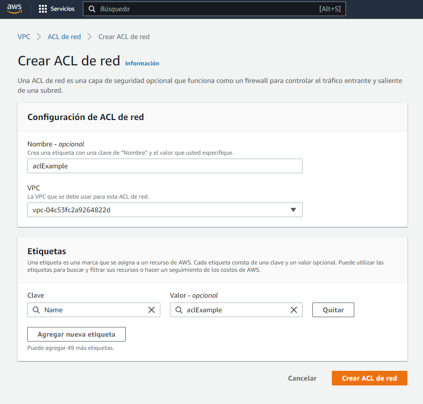

Una vez realizado este paso, podemos observar que se ha creado la nueva ACL. 

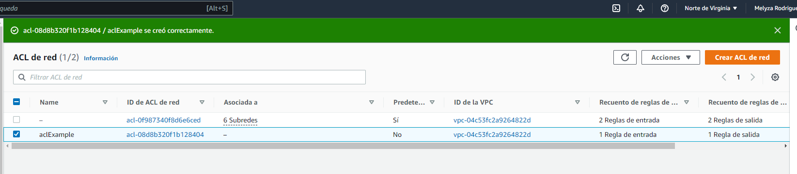

5. Seleccionar la ACL que se creo anteriormente. 

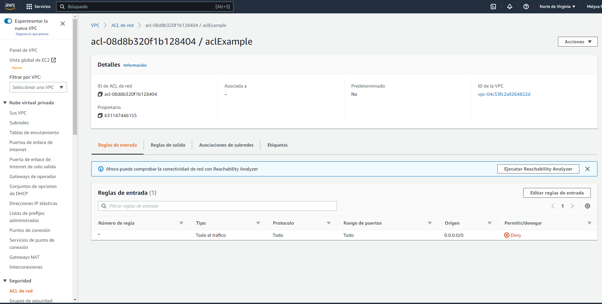

Ahora, podemos editar las reglas, tanto de entrada como de salida, a nuestra conveniencia. 

### Creación de una regla de entrada
1. Ubicarse en la pestaña **Reglas de entrada** (dentro de la ACL creada) y hacer click sobre el botón **Editar reglas de entrada**.

2. Seleccionar la opción **Crear nueva regla** y rellenar todos los campos que se solicitan. 

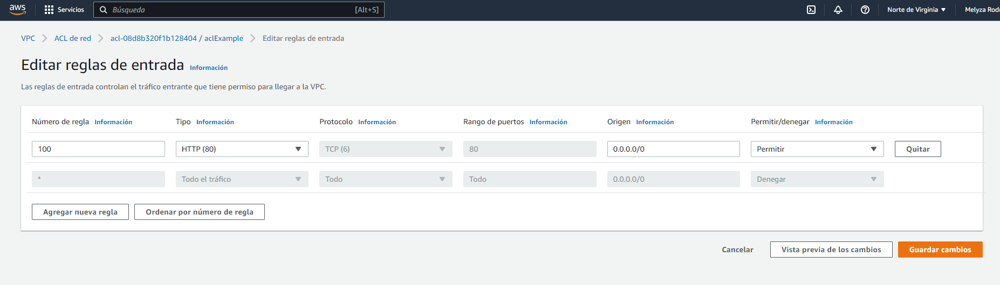

3. Guardar los cambios y verificar la creación de la regla de entrada. 

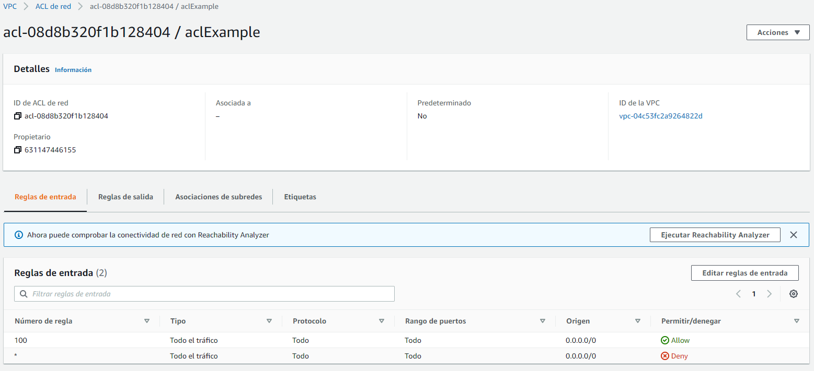

### Creación de una regla de salida 
1. Ubicarse en la pestaña **Reglas de salida** (dentro de la ACL creada) y hacer click sobre el botón **Editar reglas de salida**.

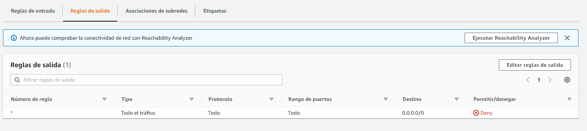

2. Seleccionar la opción **Crear nueva regla** y rellenar todos los campos que se solicitan. 

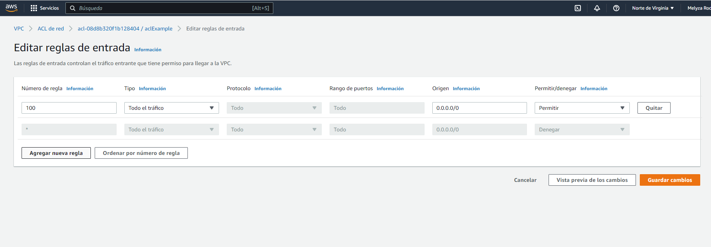

3. Guardar los cambios y verificar la creación de la regla de salida. 

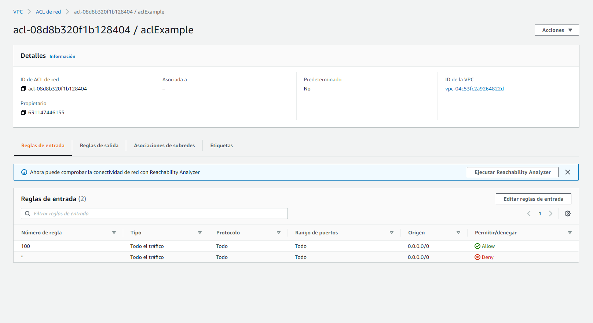
