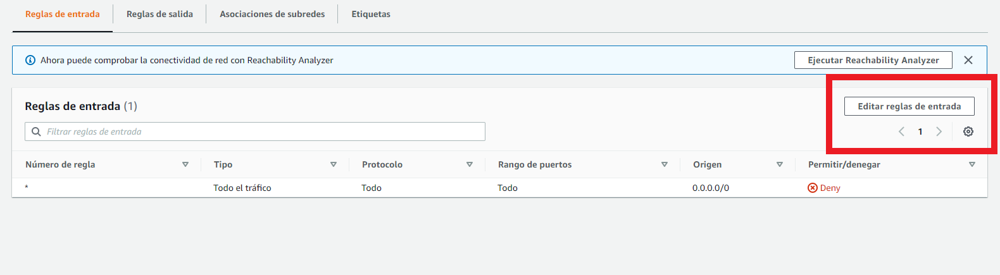

>
>
>Universidad San Carlos de Guatemala
>
>Facultad de Ingeniería 
>
>Escuela de Ciencias y Sistemas 
>
>Segundo Semestre, 2022
>
>Laboratorio de Redes de Computadoras 2 

### Grupo No.5

Integrantes:

| Nombre                               | Carnet    |
| ------------------------------------ | --------- | 
|  &nbsp;Jimmy Yorbany Noriega Chávez         | 200915691 |
|   &nbsp; Melyza Alejandra Rodríguez Contreras | 201314821 |
|  &nbsp; Romael Isaac Pérez Godinez           | 201213545 | 
|  &nbsp; Josué Alfredo González Caal          | 201602489 | 

# Proyecto - Fase 2

## Contenido
- Creación de una VPC
- Tablas de enrutamiento
- Subredes
  - Públicas
  - Privadas
- Implementacion de ACLs para controlar el tráfico en las subredes 
- Implementacion de Security Group

## Implementacion de una VPC
> Amazon Virtual Private Cloud permite lanzar recursos de AWS en una red virtual privada que el usuario puede definir. Esta red virtual es muy similar a la red tradicional que se usaria en el propio centro de datos.
>
> **Entre se sus caracteristicas podemos encontrar:**
> **Subredes:** Una subred es es un rango de direcciones IP en su VPC. Una subred debe residir en una sola zona de disponibilidad. Después de agregar subredes, puede implementar recursos de AWS de su VPC.
> **Direccionamiento IP:** Se puede asignar direcciones IPv4 y direcciones IPv6 a las VPC y subredes.
> **Direccionamiento:** Se pueden utilizar **tablas de enrutamiento** para determinar dónde se dirige el tráfico de red de su subred o puerta de enlace.
> **Puertas de enlace y puntos de conexion:** Una puerta de enlace conecta su VPC a otra red. Por ejemplo, use una puerta de enlace de Internet para conectar la VPC a Internet. Use un punto de conexión de VPC para conectarse a Servicios de AWS de forma privada, sin el uso de una puerta de enlace de Internet o un dispositivo NAT.
>
> 

### Pasos para crear una vpc en AWS
1. Ingrese al **Amazon VPC** dentro de la consola de AWS

2. En el panel de navegacion, elija **Sus VPC**, **Crear VPC**

3. En **Crear VPC** se debe elejir **Solo VPC**

4. Especificar los siguientes detalles para la creacion de la VPC
**Name Tag:** Indique, de manera opcional, un nombre para su VPC. Esta acción creará una etiqueta con una clave de Name y el valor que especifique.
**Bloque CIDR de IPV4:** Especifique un bloque de CIDR de IPv4 (o un rango de direcciones IP) para la VPC. Elija una de las siguientes opciones:
**Entrada manual de CIDR IPV4:** Introduzca manualmente un CIDR de IPv4. El bloque de CIDR debe ser de un tamaño de entre /16 y /28. Se recomienda especificar un bloque de CIDR de los rangos de direcciones IP privadas
**Bloques de CIDR de IPV4 con asignacion de IPAM:** Si hay un grupo de direcciones IPv4 de IP Address Manager (IPAM) de Amazon VPC disponible en esta región, puede obtener un CIDR de un grupo de IPAM. Si selecciona un grupo de IPAM, el tamaño del CIDR está limitado por las reglas de asignación del grupo de IPAM (mínimo permitido, máximo permitido y predeterminado).

**Bloque CIDR de IPV6:** De forma opcional, puede asociar un bloque de CIDR IPv6 con su VPC. Elija una de las siguientes opciones y, a continuación, elija Select CIDR (Seleccionar CIDR):
**No IPv6 CIDR block:** no se aprovisionará ningún CIDR IPv6 para esta VPC.
**Bloque de CIDR de IPv6 con asignación de IPAM:**  Si hay un grupo de direcciones IPv6 de IP Address Manager (IPAM) de Amazon VPC disponible en esta región, puede obtener un CIDR de un grupo de IPAM. Si selecciona un grupo de IPAM, el tamaño del CIDR está limitado por las reglas de asignación del grupo de IPAM (mínimo permitido, máximo permitido y predeterminado).
**Amazon-provided IPv6 CIDR block:** solicita un bloque de CIDR IPv6 de un grupo de direcciones IPv6 de Amazon. En Network Border Group (Grupo de borde de red), seleccione el grupo desde el que AWS anuncia las direcciones IP. Amazon proporciona un tamaño de bloque de CIDR de IPv6 fijo de /56. No es posible configurar el tamaño del CIDR de IPv6 que proporciona Amazon.
**IPv6 CIDR owned by me (CIDR IPv6 de mi propiedad:** asigna un bloque de CIDR IPv6 de su grupo de direcciones IPv6. En Pool (Grupo), elija el grupo de direcciones IPv6 desde el que desea asignar el bloque de CIDR IPv6.

**Tenancy:** Seleccione **Default** para garantizar que las instancias de EC2 lanzadas en esta VPC utilicen el atributo de tenencia de la instancia de EC2 especificado al lanzarlas. O seleccione **Dedicated** para garantizar que las instancias de EC2 lanzadas en esta VPC se ejecuten en instancias de tenencia dedicada, independientemente del atributo de tenencia especificado al lanzarlas.

**Tags:**  Agrega etiquetas opcionales a la VPC. Una etiqueta es una marca que se asigna a un recurso de AWS. Cada etiqueta consta de una clave y un valor opcional.

5. Seleccione **Crear VPC**.

## Tablas de enrutamiento 

Una tabla de enrutamiento, también conocida como tabla de encaminamiento, es un documento electrónico que almacena las rutas a los diferentes nodos en una red informática. Los nodos pueden ser cualquier tipo de dispositivo electrónico conectado a la red. La tabla de enrutamiento generalmente se almacena en un router o en una red en forma de una base de datos o archivo. Cuando los datos deben ser enviados desde un nodo a otro de la red, se hace referencia a la tabla de enrutamiento con el fin de encontrar la mejor ruta para la transferencia de datos.

El proceso de creación y administración de las tablas de enrutamiento en AWS es el siguiente. 

- Debemos ingresar al panel de VPC y dirigirnos a la opción **Tabla de enrutamiento**.

- Cuando elegimos la opción **Crear una tabla de enrutamiento**, se nos mostrará una pantalla en la que debemos ingresar un nombre que nos permita ingresar de manera sencilla la tabla, así como la VPC a la cual se va a aplicar.

- Presionamos en **Crear tabla de enrutamiento** y observamos que la tabla se ha creado con éxito. 

## Creación de subredes 

Una subred es una red dentro de una red. Las subredes hacen que las redes sean más eficientes. Mediante la creación de subredes, el tráfico de la red puede recorrer una distancia más corta sin tener que pasar por routers innecesarios para llegar a su destino.

### Pasos para la creación de una subred en AWS

1. Ingresar a la consola de AWS, específicamente al apartado de **VPC** y dirigirse a la opción Subredes ubicada en el panel izquierdo. 

2. Hacer click sobre la opción **CREAR**

3. Seleccionamos la VPC cuya red deseamos segmentar. Además, ingresamos el nombre de la subred, la zona de dispoinibilidad y el bloque de CIDR IPv4

> ¿Cómo se determina el bloque de CIDR IPv4?
>
> Este corresponde a la porción de la red que queremos seccionar, lo podemos calcular mediante FLSM o VLSM haciendo el análisis correspondiente para cada red. 
> 
> 

4. Hacemos click en crear y observamos que la subred fue creada con éxito y ahora aparece en la lista de subredes, en modo **Disponible**.

5. Repetimos los pasos anteriores en función de cuantas veces necesitamos o deseamos fragmentar nuestra red. 

### Subredes públicas

Una red pública se caracteriza porque los recursos dentro de ella tienen acceso a internet, esto se logra mediante la utilización de un ***internet gateway***. 

Para crear un ***internet gateway*** debemos dirigirnos, dentro del menú de VPC, a la opción **Puertas de enlace de internet**, en este apartado podemos observar los diferentes internet gateways creados.

Para crear uno nuevo, hacemos click en la opción **Crear gateway de internet**, esto nos permitirá ingresar una etiqueta que identifique al gateway a crear. 

Pulsamos en **CREAR** y vemos que se creó con éxito, ahora podemos administrarlo y utilizarlo para configurar nuestra tabla de enrutamiento y así poder tener salida a internet.

Ahora, para determinar que la red es pública, necesitamos crear una ruta con acceso a internet desde una tabla de enrutamiento y asignarla a la subred creada. 

Para esto, nos dirigimos a la tabla de enrutamiento elegida y creamos la ruta utilizando el internet gateway realizado anteriormente. 

Posteriormente, creamos una ruta hacia cualquier lugar por medio de nuestro internet gateway. 

Guardamos los cambios y observamos que la ruta fue creada. 

Ahora, solamente debemos asignar la tabla de enrutamiento en la que creamos esta ruta con salida a internet, a la subred que deseamos configurar como **pública**.

Guardamos los cambios y verificamos la conectividad. 

## Implementacion de ACLs para controlar el tráfico en las subredes 
> ¿Qué es una ACL?
> 
> Por sus siglas en inglés ***access control list***, una ***lista de control de acceso*** es un concepto de seguridad informática usado para fomentar la separación de privilegios. Es una forma de determinar los permisos de acceso apropiados a un determinado objeto, dependiendo de ciertos aspectos del proceso que hace el pedido.
> 
> Las ***ACL*** permiten controlar el flujo del tráfico en equipos de redes, tales como enrutadores y conmutadores. Su principal objetivo es filtrar tráfico: permitir o denegar el tráfico de red de acuerdo con alguna condición. Sin embargo, también tienen usos adicionales, como, por ejemplo, distinguir "tráfico interesante" (tráfico suficientemente importante como para activar o mantener una conexión) en RDSI (red digital de servicios integrados).
> 
> 

### Pasos para configurar una lista de control de acceso en AWS
1. Ingresar al **Panel VPC** dentro de la consola de AWS

2. En el apartado de **Seguridad** (ubicado en el panel de navegación izquierdo), seleccionar la opción **ACL de red**.

3. Seleccionar la opción ***CREAR ACL DE RED***.

4. Colocar un nombre y seleccionar una VPC para crear la nueva lista de control de acceso. Posteriormente, hacer click en la opción **CREAR**, en la parte inferior de la pantalla. 

Una vez realizado este paso, podemos observar que se ha creado la nueva ACL. 

5. Seleccionar la ACL que se creo anteriormente. 

Ahora, podemos editar las reglas, tanto de entrada como de salida, a nuestra conveniencia. 

### Creación de una regla de entrada
1. Ubicarse en la pestaña **Reglas de entrada** (dentro de la ACL creada) y hacer click sobre el botón **Editar reglas de entrada**.

2. Seleccionar la opción **Crear nueva regla** y rellenar todos los campos que se solicitan. 

3. Guardar los cambios y verificar la creación de la regla de entrada. 

### Creación de una regla de salida 
1. Ubicarse en la pestaña **Reglas de salida** (dentro de la ACL creada) y hacer click sobre el botón **Editar reglas de salida**.

2. Seleccionar la opción **Crear nueva regla** y rellenar todos los campos que se solicitan. 

3. Guardar los cambios y verificar la creación de la regla de salida. 

## Implementacion de Security Group
> Un ***Security Group** o grupo de seguridad controla el trafico que puede llegar y salir de los recursos con los que esta asociado. Cuando se crea una ***VPC*** esta biene con un grupo de seguridad asociado.
> Para cada grupo de seguridad, se pueden agregar reglas que controlan el trafico en funcion de los protocolos y los numeros de puertos. Hay conjuntos separados de reglas para el trafico entrante y saliente.
>

## Reglas de Entrada y Salida para un grupo de seguridad

## Grupos de seguridad creados
# Para el LoadBalancer:
> Reglas de entrada: Todo el trafico
> Reglas de salida: Todo el trafico
> Justificacion: Esta regla fue definida para todo el trafico de entrada ya que sera la puerta de entrada desde internet por lo tanto se debe configurara que permita **todo el trafico**

# Para las instancias de API:
> Reglas de entrada:
> Reglas de salida: 
> Justificacion: 

## Pasos para configurar un Security Group
1. Ingrese al panel de navegacion y elija **security groups**

2. Elija **Crear grupo de seguridad**

3. Ingrese un nombre y una descripción para el grupo de seguridad. No puede cambiar el nombre ni la descripción de un grupo de seguridad después de crearlo

4. Elija la **VPC** a la cual se le asignara el grupo de seguridad
5. Puede agregar reglas de grupo de seguridad ahora o más adelante.

7. Elija Create Security Group (Crear grupo de seguridad).

